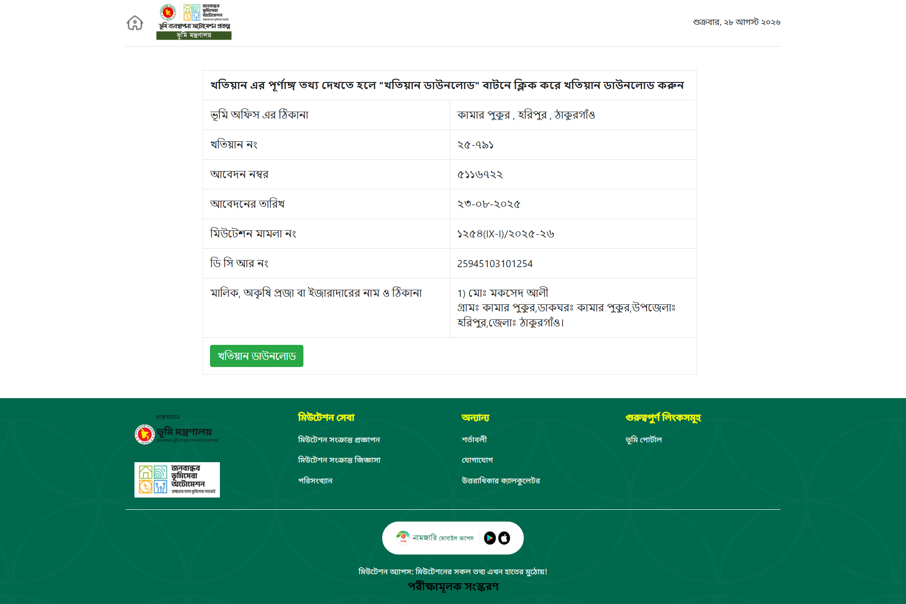

# 🏛️ Mutation Land - নামজারি খতিয়ান অনলাইন ভেরিফিকেশন ও লাইভ এডিটর প্ল্যাটফর্ম

বাংলাদেশ ভূমি মন্ত্রণালয়ের অফিসিয়াল **ভূমি ব্যবস্থাপনা অটোমেশন সিস্টেম (e-Mutation System)**-এর আদলে নির্মিত একটি আধুনিক ওয়েবাসাইট ও নামজারি খতিয়ান লাইভ এডিটর প্ল্যাটফর্ম।



---

## ✨ মূল ফিচারসমূহ (Features)

1. **অফিসিয়াল ভেরিফিকেশন হোমপেজ (`/`)**:
   - `mutation.land.gov.bd`-এর আদলে নির্মিত ডিজিটাল ভেরিফিকেশন পেজ।
   - ভূমি মন্ত্রণালয়ের লোগো, বর্তমান তারিখ, খতিয়ানের অনলাইন সামারি ডাটা টেবিল ও অফিসিয়াল ফুটার।
   - **"খতিয়ান ডাউনলোড / এডিটর"** বাটনে এক ক্লিকেই লাইভ এডিটরে প্রবেশের সুবিধা।

2. **লাইভ খতিয়ান এডিটর (`/khatian`)**:
   - **ইন্টারেক্টিভ এডিটর ড্রয়ার**: খতিয়ান নং, আবেদন নম্বর, ডিসিআর নং, কেস নম্বর, মৌজা, জেএল নং এবং মালিকের নাম-ঠিকানা রিয়েল-টাইমে পরিবর্তন করার সুবিধা।
   - **ডাইনামিক দাগ/প্লট ম্যানেজার**: প্রয়োজনে নতুন দাগ (Dag) যোগ করা, তথ্য এডিট করা বা মুছে ফেলার সুবিধা।
   - **অফিসিয়াল সিগনেচার ও সীল**: প্রস্তুতকারী ও অনুমোদনকারী কর্মকর্তার নাম, পদবী, তারিখ ও ড্রয়ার থেকে সম্পাদনাযোগ্য গোল সীল।
   - **রিসেট অপশন**: যেকোনো সময় সরকারি ডিফল্ট নামজারি খতিয়ান ডামি ডাটাতে রিসেট করার ব্যবস্থা।

3. **১:১ পিক্সেল-পারফেক্ট A4 Landscape প্রিন্ট ব্যবস্থা**:
   - সরকারি `name.pdf` (নামজারি খতিয়ান)-এর অনুরূপ ২-সারির টেবিল হেডার ও নিখুঁত বর্ডার স্ট্রাকচার।
   - প্রতি পৃষ্ঠায় অটোমেটিক **QR Code** জেনারেশন (`qrcode.react`) যা অনলাইন ভেরিফিকেশন লিংকের সাথে যুক্ত।
   - ব্যাকগ্রাউন্ডে বাংলাদেশ সরকারের হালকা জলছাপ (Watermark Seal)।
   - `@media print` অপটিমাইজড: ব্রাউজার থেকে সরাসরি ১:১ পিক্সেল-পারফেক্ট **A4 Landscape** পিডিফ ডাউনলোড ও প্রিন্ট সুবিধা।

---

## 🛠️ ব্যবহৃত প্রযুক্তিসমূহ (Tech Stack)

- **Framework**: Next.js 15 (App Router)
- **Library**: React 19
- **Styling**: Tailwind CSS v4
- **Language**: TypeScript
- **Fonts**: `SolaimanLipi` (Local Font), `Hind Siliguri` (Google Font)
- **Icons**: Lucide React Icons
- **QR Code**: `qrcode.react`

---

## 📁 প্রজেক্ট ফোল্ডার স্ট্রাকচার (Project Structure)

```text
Mutation-Land/
├── public/
│   ├── assets/              # লোগো, ওয়াটারমার্ক, ফেভিকন ও স্ক্রিনশট ইমেজ
│   └── fonts/               # SolaimanLipi বাংলা ফন্ট ফাইলসমূহ
├── src/
│   ├── app/
│   │   ├── globals.css      # টেলউইন্ড ও A4 প্রিন্ট সিএসএস রুলস
│   │   ├── layout.tsx       # রুট লেআউট ও ফন্ট কনফিগারেশন
│   │   ├── page.tsx         # ভেরিফিকেশন হোমপেজ
│   │   └── khatian/
│   │       └── page.tsx     # লাইভ খতিয়ান এডিটর পেজ
│   ├── components/
│   │   ├── khatian/
│   │   │   ├── KhatianForm.tsx  # এডিটর সাইডবার / ড্রয়ার ফর্ম
│   │   │   └── KhatianSheet.tsx # A4 Landscape প্রিন্ট খতিয়ান শীট
│   │   └── layout/
│   │       └── Navbar.tsx       # নেভিগেশন বার
│   ├── data/
│   │   └── dummyKhatian.ts  # সরকারি খতিয়ান ডিফল্ট ডাটা
│   └── types/
│       └── khatian.ts       # খতিয়ান ডাটা টাইপ ইন্টারফেস
├── package.json
└── tsconfig.json
```

---

## 🚀 লোকাল মেশিনে রান করার নিয়ম (Getting Started)

১. **রেপোজিটরি ক্লোন করুন**:
```bash
git clone https://github.com/ishtiaqrobin/mutation-system.git
cd mutation-system
```

২. **ডিপেন্ডেন্সি ইনস্টল করুন**:
```bash
npm install
```

৩. **ডিভেলপমেন্ট সার্ভার চালু করুন**:
```bash
npm run dev
```

৪. ব্রাউজারে প্রবেশ করুন:
- **হোমপেজ**: [http://localhost:3000](http://localhost:3000)
- **খতিয়ান এডিটর**: [http://localhost:3000/khatian](http://localhost:3000/khatian)

---

## 🖨️ প্রিন্ট করার উপায় (How to Print)

১. `/khatian` পেজে গিয়ে আপনার পছন্দমতো তথ্য পরিবর্তন করুন।
২. উপরে ডানপাশের **"প্রিন্ট খতিয়ান (A4)"** বাটনে ক্লিক করুন (অথবা আপনার কীবোর্ডে `Ctrl + P` চাপুন)।
৩. প্রিন্ট প্রিভিউ উইন্ডোতে Paper Size **A4** এবং Orientation **Landscape** সিলেক্ট করে Save as PDF দিন।

---

## 📄 লাইসেন্স (License)

প্রজেক্টটি ব্যক্তিগত এবং শিক্ষণীয় উদ্দেশ্যে নির্মিত। 
